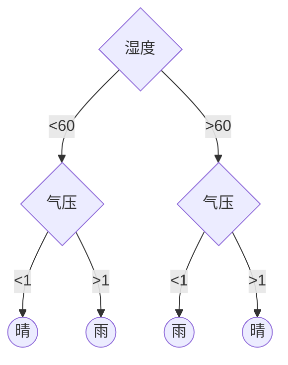

# Python Spark MLlib 决策树二元分类
## 13.1 决策树介绍


党我们使用数据训练决策树时, 不可能任其无限成长, 须设定最大分支与最大深度.所以须设定以下几个参数:
* maxBins: 每一个节点的最大分支数目
* maxDepth: 决策树最大深度
* Impurity:决策树分裂节点时的算法
    * Gini基尼指数
    * Entropy熵

## 13.2 决策树二元分类示例
[http://www.stumbleupon.com](http://www.stumbleupon.com)会根据用户的兴趣和网页评价推荐用户喜欢的网页.有些网页用户可能只有短时间类会有兴趣, 过了 一阵子就失去了兴趣, 如当日股价, 季节菜单等.这种网页称为<font color='red'>暂时性的. </font>而有些网页如育儿知识, 理财观念则可能会一直感兴趣.这种网页称为<font color='red'>长青的</font>.

那么问题来了, 如何将网页分为暂时性的或者是长青的呢?
本章采用决策树二元分类解决该问题, 后续章节还会有逻辑回归, 支持向量机, 朴素贝叶斯等方法来解决该问题, 敬请期待

## 13.3 决策树二元分类机器学习
### 13.3.1 设计决策树二元分类模型面临的问题:
* 如何收集资料
    StumbleUpon已经积累了大量的网页资料, 直接拿来用即可
* 初始数据是文字如何将数据转换为可用的数据(`LabeledPoint`)
    提取特征栏位和标签栏位, 转化为`LabeledPoint`
* 如何训练模型
    执行DecisionTree训练
* 如何进行预测
    建立模型后可以用这个模型进行预测
* 如何评估准确率
    AUC评估二元分类(ROC曲线下的面积, FPR横坐标, TPR纵坐标)

* 模型的训练参数如何影响准确率
* 如何找出参数最优组合
    排列组合, 将所有的参数都训练一次, 找出最好的组合
* 如何确认是否过度拟合
    用测试数据进行测试, 如果测试的AUC很高, 测试阶段很低, 则可能有过拟合, 如果差异不大, 则代表无过拟合问题
## 13.4 收集资料

## 准备资料
```{python id:"j1hmxens"}

```
<font size=5>[返回目录](../目录.md)</font>
