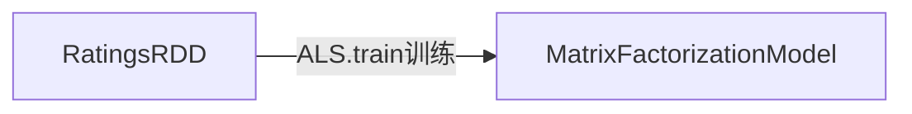

# 12. Python Spark建立推荐系统
## 12.1 常用推荐算法介绍
常见的推荐系统算法有:
算法|说明|举例
:----:|:----:|:----:
基于关联规则的推荐|消费者购买产品A, 那么他有多大机会购买产品B|购物篮分析
基于内容的推荐|分析网页内容自动分类, 再将使用者自动分类|将新进来的已分类的网页推荐给对该群感兴趣的使用者
人口统计式的推荐|将使用者按其属性(性别, 年龄, 教育背景等)作为分类的指标|以此类别作为推荐的基础
协同过滤式的推荐|通过使用者对产品的评价, 来推断使用者的喜好|找出与你对产品的评价相近的使用者, 他喜欢的产品你多半也会喜欢

本节主要介绍协同过滤式的推荐(Collaborative Filtering), 优缺点如下:
* 优点
    * 可以达到人性化推荐
    * 不需要内容分析
    * 可以发现用户新的兴趣点
    * 自动化程度高
* 缺点
    * 冷启动问题:如没有历史数据则无法进行分析
    * 新使用者问题: 新使用者没有评价, 就不知道他的喜好
## 12.2 推荐系统实例--电影推荐系统
使用MLlib的ALS算法(协同过滤), 采用该方法可以解决<font color='red'>稀疏矩阵</font>的问题, 可以在短时间内完成运算
- 给推荐用户可能感兴趣的电影
- 把电影推荐给有可能感兴趣的用户

## 12.3 ALS协同过滤算法介绍
协同过滤通过用户的评价来做推荐

### Step1: 用户对产品的评价
- 明确评价
网站上的1~5星的评分, 将其列为矩阵

用户\电影|ItemA|ItemB|ItemC|ItemD|ItemE
:----:|:----:|:----:|:----:|:----:|:----:
User1|2|1|5|null|null
User2|1|3|1|1|null
User3|3|null|null|4|nulll
User4|2|null|2|1|2
User5|1|1|1|4|1


- 隐性评价
记录用户时候挑选过该产品, 若挑过, 则可能有兴趣

用户\电影|ItemA|ItemB|ItemC|ItemD|ItemE
:----:|:----:|:----:|:----:|:----:|:----:
User1|1|1|1|null|null
User2|1|1|1|1|null
User3|1|null|null|1 |nulll
User4|1|null|1|1|1
User5|1|1|1|1|1

例如, User1对A,B,C感兴趣, 而User2对A,B,C,D都感兴趣, 则可以把D推荐给User1

### Step2: 稀疏矩阵的问题
当使用者m越来越多, 电影n也越来越多, 评价数k则相对来说比例下降($\frac k {m*n}$↓)了, 导致评分矩阵大部分是空白的, 则为稀疏矩阵, 这样的话电脑处理这么大的稀疏矩阵浪费内存, 为了解决稀疏矩阵的问题, 采用<font color='red'>矩阵分解</font>

### Step3: 矩阵分解
如图: 将原本矩阵$A(m*n)$分解成$X(m*rank)$矩阵与$Y(rank*n)$矩阵, 而且$A\approx X*Y$


## 12.4 收集资料
```{bash id:"j1h7tnoh"}
cd /home/xiligey/Study/Spark/PythonSparkHadoop/推荐系统
mkdir data
cd data
wget http://files.grouplens.org/datasets/movielens/ml-100k.zip
# tar -zxvf ml-100k.zip
unzip -j ml-100k
```
下载并解压后可以启动HDFS, 将文件上传至hdfs
```{bash id:"j1h96uwv"}
cd /home/xiligey/Study/Spark/PythonSparkHadoop/推荐系统/data
hadoop fs -copyFromLocal /home/xiligey/Study/Spark/PythonSparkHadoop/推荐系统/data/* /input/python_spark_hadoop
```
## 12.5 读取数据

```{python id:"j1h8harn"}
from pyspark import SparkConf, SparkContext, SQLContext
conf = SparkConf().setMaster('local').setAppName('ALS')
sc = SparkContext(conf=conf)
sq = SQLContext(sc)
path = r'hdfs://localhost:9000//input/python_spark_hadoop/u.data'
rawUserData = sc.textFile(path)
rawRatings = rawUserData.map(lambda line: line.split('\t')[:3])
ratingsRDD = rawRatings.map(lambda x: (x[0], x[1], x[2]))
ratingsRDD.take(5)
# 评价数
numRatings = ratingsRDD.count()
print('共计%s评价数' % numRatings)
# 用户数
numUsers = ratingsRDD.map(lambda x: x[0]).distinct().count()
print('共计%s用户数' %s numUsers)
# 电影数
numMovies = ratingsRDD.map(lambda x: x[1]).distinct().count()
print('共计%s电影数' %s numMovies)
```

## 12.6 训练模型
如下图, 我们将使用`rawUserData`数据, 以`map`转换为`rawRatings`, 再以`map`转换为`ALS`训练数据`RDD`格式, 然后使用`ALS.train`进行训练, 训练完成会建立推荐系统模型`MatrixFactorizationModel`

我们要使用`ALS.train`进行训练, 可分为明确评价和隐含式评价两种训练模式:

- 明确训练:
ALS.train(ratings, rank ,iterations=5, lambda_=0.01)
返回MatrixFactorizationModel

- 隐含式训练:
ALS.trainlmplicit(ratings, rank, iterations=5, lambda_=0.01)

参数|说明
:----:|:----:
ratings|训练样本,格式为Rating(userId, productID, rating)的RDD
rank|矩阵分解时将原本的矩阵$A(m*n)$分解成$X(m*rank)$和$Y(rank*n)$
iterations|ALS算法的迭代次数, 默认为5
lambda_|预设为0.01
返回值|MatrixFactorizationModel返回一个模型

<font color='red'>以上这些参数会影响结果的准确率, 以及训练所需时间, 后续章节会说明如何调节参数以找出最佳的参数组合</font>

```{python continue:"j1h8harn", id:"j1habdo8"}
from pyspark.mllib.recommendation import ALS
model = ALS.train(ratingsRDD, 10, 10, 0.01)
print(model)
```
## 12.7 使用模型进行推荐

### Sep1. 对用户推荐电影
我们可以对每一个会员, 定时发送email或消息推荐他可能感兴趣的电影
针对用户推荐电影, 可以用`model.recommendProducts`方法来推荐, 说明如下:
参数|说明
:----:|:----:
user|要被推荐的用户id
num|推荐的电影数
返回|返回Rating(user, product, rating)的list, list中每一行都是一个推荐的产品, 回传的list会以rating由大到小排序

```{python continue:"j1habdo8", id:"j1hei8v6"}
model.recommendProducts(100, 5)
```
### Step2. 查看针对用户推荐产品的评分
查看系统对用户推荐的产品的评分
```{python continue:"j1hei8v6", id:"j1henyoa"}
model.predict(100, 1643)
```

### Step3. 针对电影推荐给用户
当我们想促销某些电影时, 可以找出可能会对电影感兴趣的会员, 给他们发送email
针对电影推荐给用户, 可以使用`model.recommendUsers`方法推荐, 说明如下:
参数|说明
:----:|:----:
product|需要被推荐的产品id
num|推荐的人数
返回|返回Rating(user, product, rating)的list, list的每一行都是系统针对产品推荐给使用者, rating是系统给的评分, rating越高越好
```{python continue:"j1henyoa", id:"j1hetbt5"}
model.recommendUsers(product=200, num=5)
```

## 12.8 保存模型到本地文件或者hdfs
```{python continue:"j1hetbt5", id:"j1hfha4u"}
try:
    model.save(sc, r'file:/home/xiligey/Study/Spark/PythonSparkHadoop/ALSmodel')
except Exception as e:
    print(e)
    print('Model已经存在, 请先删除再存储或者更换目录')
```

## 12.9读取已经保存的模型
```{python continue:"j1hfha4u" id:"j1hfk4zn"}
from pyspark.mllib.recommendation import MatrixFactorizationModel
try:
    model_ = MatrixFactorizationModel.load(sc, r'file:/home/xiligey/Study/Spark/PythonSparkHadoop/ALSmodel')
    print("ID为9的用户+ID为200的电影的得分为%s" % model_.predict(9, 200))
except Exception as e:
    print(e)
    print('无法找到模型, 请先训练或更换目录')

```
<font size= 5 color='#FF9797'>代码示例:</font>
- [协同过滤参考代码](协同过滤.py)


<font size=5>[返回目录](../目录.md)</font>
